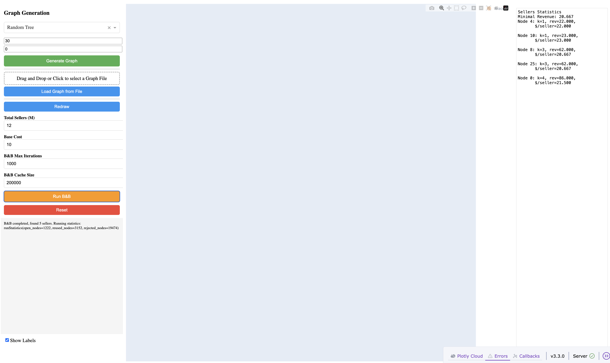

# Hotelling's Model Simulation and Optimization

<p align="center">

</p>

## Table of Contents

- [Project Overview](#project-overview)
- [Features](#features)
- [Installation](#installation)
- [Running the Web Dashboard](#running-the-web-dashboard)
- [Project Structure](#project-structure)
- [Usage](#usage)
- [Hotelling's Model Theory](#hotellings-model-theory)
- [Parameters](#parameters)
- [Dependencies](#dependencies)
- [Contributing](#contributing)
- [License](#license)
- [Acknowledgments](#acknowledgments)
- [Application Screenshots](#application-screenshots)

## Project Overview

This project implements a simulation and optimization framework for Hotelling's model of spatial competition, where competitors (sellers) locate on a graph representing markets (consumers). The model calculates market shares, revenues, and optimal seller placements using Branch & Bound algorithm.

## Features

- Graph-based market representation with customizable generators (line, star, tree, grid graphs)
- Interactive web dashboard built with Dash for real-time visualization and experimentation
- Branch & Bound optimization for finding optimal seller locations
- Statistical analysis of seller performance and revenues
- Customizable parameters: seller count, base cost, algorithm settings
- Graph visualization with layout persistence and label controls

## Installation

### Prerequisites

- Python 3.12+
- Graph-tool
- Required Python packages (auto-installed with pip setup)

### Setup Instructions

1. Clone the repository:

   ```bash
   git clone https://github.com/xxamxam/hoteling_modeling.git
   cd hoteling_modeling
   ```
2. Install dependencies using pixi or conda:

   **Using pixi (recommended):**

   ```bash
   pixi install
   ```

   **Using conda:**

   ```bash
   conda install -c conda-forge graph-tool python-graphviz plotly dash numpy pandas
   pip install -e .
   ```
3. Ensure graph-tool is properly installed (may require conda environment setup)

## Running the Web Dashboard

To run the interactive web application:

```bash
python -m hoteling.dash_panel.run --port=8050
```

This will start a Dash server on http://127.0.0.1:8050 with debug mode enabled.

Alternatively, from python:

```python
from hoteling.generators.graph_generators import generate_line_graph
from hoteling.algorithms.branch_bound import BaseRevenueFunction
from hoteling.dash_panel.dash_app import create_minimal_dash_app
g = generate_line_graph(6)
rf = BaseRevenueFunction(base_cost=10)
app = create_minimal_dash_app(g, initial_M=3, rf=rf)
app.run(debug=True)
```

## Project Structure

```
hoteling/
├── game_evaluation.py   # Game evaluation utilities
├── hoteling_game.py     # Core HotellingGame class with state management
├── algorithms/          # Algorithm implementations
│   └── branch_bound.py  # Branch & Bound optimization
├── dash_panel/          # Web dashboard components
│   ├── dash_app.py      # Main Dash application
│   ├── dash_html.py     # HTML layout definitions
│   ├── dash_plot.py     # Plotting and visualization functions
│   └── run.py           # CLI runner for the dashboard
├── generators/          # Graph generation utilities
│   └── graph_generators.py  # Various graph generators
└── plot_utils/          # Utility plotting functions
    ├── graph_tool_plot.py
    └── widget.py

notebooks/               # Jupyter notebooks for analysis
├── testing.ipynb        # Testing and experiments

README.md               # This file
pyproject.toml          # Package configuration
pixi.lock              # Environment lock file
```

## Usage

### Core Components

#### Graph Generators (`generators/graph_generators.py`)

Provides functions to generate different graph structures:

- `generate_line_graph(n)`: Linear graph with n vertices
- `generate_star_graph(n_leaves)`: Star graph with center and n leaves
- `generate_random_tree(n, seed)`: Random tree with n vertices
- `generate_grid_graph(rows, cols)`: Grid graph

#### Branch & Bound Algorithm (`algorithms/branch_bound.py`)

- `BaseRevenueFunction`: Revenue calculation class
- `Node`: Position calculation for sellers
- `BBTree`: Optimization algorithm to find optimal seller placements

#### HotellingGame Class (`hotelling_game.py`)

Main game state management class with methods for:

- Parameter updates: `update_parameters(M, base_cost, max_iter, cache_size)`
- Graph setting: `set_graph(generator_name, **params)`
- Seller operations: `toggle_seller(node_id)`, `reset_sellers()`
- Optimization: `run_branch_and_bound()`
- UI: `make_figure(show_labels=True)`, `compute_stats()`

#### Web Dashboard (`dash_panel/`)

Interactive interface with:

- **Left Panel**: Controls for graph generation, seller management, algorithm parameters
- **Middle Panel**: Interactive graph visualization with click-to-add/remove sellers
- **Right Panel**: Seller statistics sorted by revenue

Key features:

- Generate new graphs with customizable parameters
- Load custom graphs from files (text format with vertices and edges)
- Manual seller placement via graph clicks
- Automatic optimization using Branch & Bound
- Configurable algorithm parameters (iterations, cache size)
- Real-time statistics and revenue analysis

### API Example

```python
from hoteling.generators.graph_generators import generate_line_graph
from hoteling.algorithms.branch_bound import BaseRevenueFunction, BBTree

# Create a line graph with 6 vertices
g = generate_line_graph(6)

# Initialize revenue function with base cost 10
rf = BaseRevenueFunction(base_cost=10)

# Run Branch & Bound for 3 sellers
bbt = BBTree(g, M=3, rf=rf, verbose=False)
bbt.run(max_iterations=1000)

print(f"Optimal seller positions: {bbt.occupation}")
```

#### Loading Graphs from Files (`generators/graph_reader.py`)

```python
from hoteling.generators.graph_reader import read_graph_from_file

# Load graph from file (format: first line is n, then n lines of "u v weight")
g = read_graph_from_file("path/to/graph.txt")
```

## Hotelling's Model Theory

Hotelling's model studies spatial competition where:

- Consumers are located on a graph
- Sellers set prices and locations
- Consumer chooses nearest seller (ties broken arbitrarily)
- Revenue calculations based on market share and distance/price

In this implementation:

- Graph represents market locations
- Edges represent possible connections
- Sellers compete for consumer clusters
- Branch & Bound finds optimal M seller placements

## Parameters

### Algorithm Parameters

- `M`: Total number of sellers
- `base_cost`: Fixed cost per seller per period
- `max_iterations`: Branch & Bound iteration limit
- `cache_maxsize`: LRU cache size for performance

### Graph Types

Each with customizable size parameters for experimentation

## Dependencies

- graph-tool: Graph manipulation and algorithms
- dash: Web application framework
- plotly: Graph visualization
- numpy: Numerical computations
- pandas (optional, for data processing)

## Contributing

1. Fork the repository
2. Create a feature branch (`git checkout -b feature/AmazingFeature`)
3. Commit changes (`git commit -m 'Add some AmazingFeature'`)
4. Push to branch (`git push origin feature/AmazingFeature`)
5. Open a Pull Request

## License

This project is licensed under the MIT License - see the LICENSE file for details.

## Acknowledgments

This implementation is based on Hotelling's "Stability in Competition" (1929) and modern computational approaches to location optimization problems.

## Application Screenshots

*Placeholder for screenshots of the web dashboard. User will add actual images here.*

Note: Add screenshots showing the interactive dashboard with graph visualization, controls, and statistics panels.
